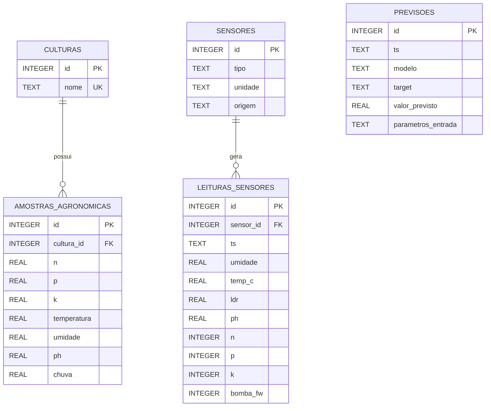

# Diagrama Entidade-Relacionamento — FarmTech Solutions

## DER (Mermaid)

## Decisões de Modelagem

### Por que não usar uma tabela única?

O dataset histórico do ESP32 (`historico_irrigacao.csv`) e o dataset agronômico (`Atividade_Cap10`) têm
propósitos, granularidades e fontes diferentes. Uni-los em uma tabela única misturaria leituras de
hardware IoT com amostras de campo normalizadas, dificultando consultas e comprometendo a integridade
referencial.

### Normalização adotada

| Decisão | Justificativa |
|---|---|
| `culturas` separada | Evita repetição do nome da cultura em milhares de linhas; permite adicionar atributos futuros (família, ciclo) sem alterar `amostras_agronomicas`. |
| `sensores` separada | Permite registrar múltiplos sensores de tipos diferentes. A coluna `origem` distingue hardware real (ESP32) de simulado. |
| `leituras_sensores` com FK → `sensores` | Garante que toda leitura pertença a um sensor cadastrado; `bomba_fw` declarado com `CHECK (IN (0,1))` para integridade de domínio. |
| `amostras_agronomicas` com FK → `culturas` | Integridade referencial; a chave `cultura_id` permite joins eficientes para análise por cultura. |
| `previsoes` com coluna `parametros_entrada` TEXT (JSON) | As entradas do modelo variam por experimento; armazenar como JSON evita schema migration a cada mudança de feature. A coluna `target` distingue modelos de `rainfall` e `humidity`. |

### Integridade garantida por

- `PRAGMA foreign_keys = ON` ativo em todas as conexões.
- Queries 100% parametrizadas (sem interpolação de string em SQL).
- `UNIQUE` em `culturas.nome` e `CHECK` em `leituras_sensores.bomba_fw`.
