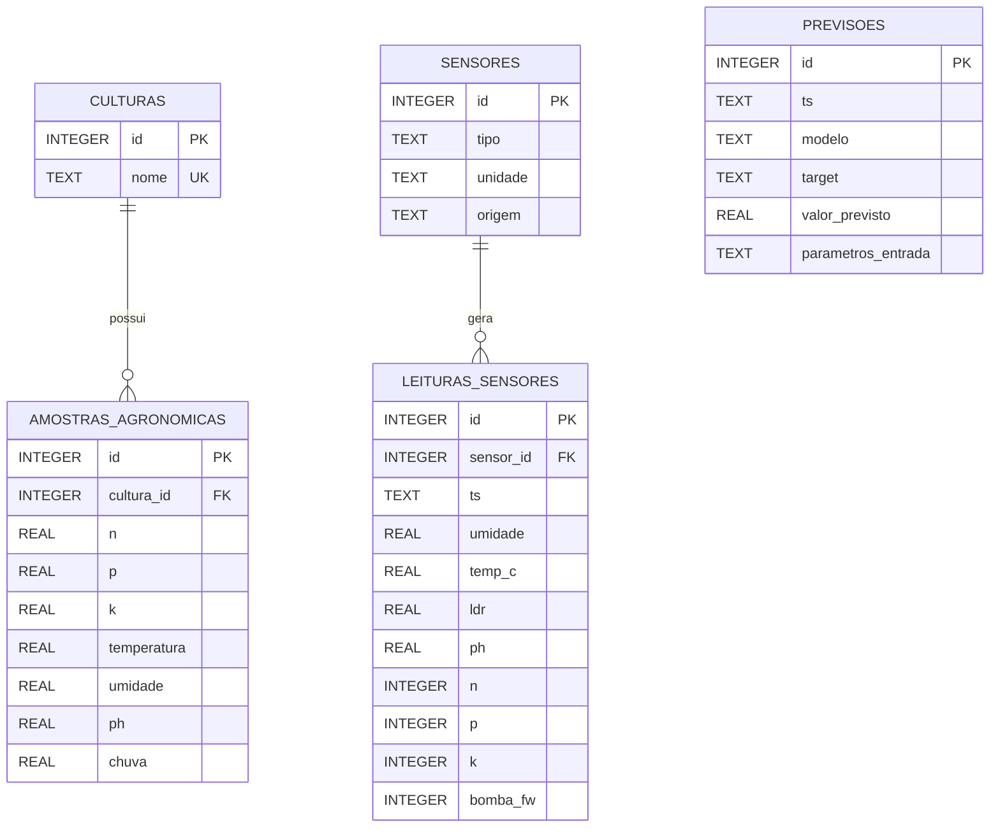

# Diagrama Entidade-Relacionamento — FarmTech Solutions

## DER (Mermaid)

## Decisões de Modelagem

### Por que não usar uma tabela única?

O dataset histórico do ESP32/Wokwi (`historico_irrigacao.csv`) e o dataset agronômico (`Atividade_Cap10`) têm
propósitos, granularidades e fontes diferentes. Uni-los em uma tabela única misturaria leituras do protótipo
IoT simulado com amostras agronômicas normalizadas, dificultando consultas, análises e manutenção do modelo
relacional.

### Normalização adotada

| Decisão | Justificativa |
|---|---|
| `culturas` separada | Evita repetição do nome da cultura em milhares de linhas; permite adicionar atributos futuros (família, ciclo) sem alterar `amostras_agronomicas`. |
| `sensores` separada | Permite registrar múltiplos sensores de tipos diferentes. A coluna `origem` diferencia fontes associadas ao ESP32/Wokwi e à simulação executada pelo scheduler. |
| `leituras_sensores` com FK → `sensores` | Relaciona cada leitura a um sensor cadastrado; `bomba_fw` é declarado com `CHECK (bomba_fw IN (0,1))` para integridade de domínio. |
| `amostras_agronomicas` com FK → `culturas` | Integridade referencial; a chave `cultura_id` permite joins eficientes para análise por cultura. |
| `previsoes` com coluna `parametros_entrada` TEXT (JSON) | As entradas do modelo variam por experimento; armazenar como JSON evita schema migration a cada mudança de feature. A coluna `target` distingue modelos de `rainfall` e `humidity`. |

### Controles de integridade adotados

- `PRAGMA foreign_keys = ON` habilitado na camada de conexão com o banco.
- Consultas parametrizadas nas operações revisadas, reduzindo o risco de SQL injection.
- Restrição `UNIQUE` em `culturas.nome` e restrição `CHECK` em `leituras_sensores.bomba_fw`.
